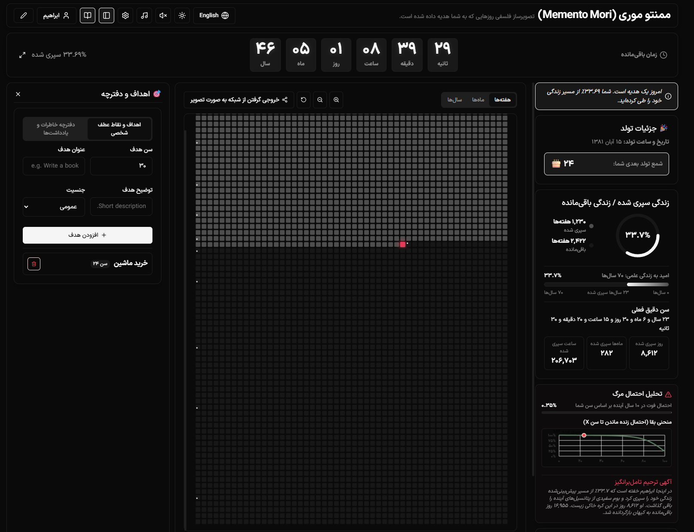

# Memento Mori - Life Visualizer (تصویرساز فلسفی زندگی)

[English](#english) | [فارسی](#persian)



---

<a name="english"></a>
## English

**Memento Mori** is a premium, highly interactive, and philosophically inspired web application designed to help you visualize your life. By representing your life in a grid of weeks, months, or years, it serves as a gentle reminder of the finite nature of time, encouraging intentional and meaningful living.

### 🌟 Key Features
*   **Bilingual & Adaptive Layout**: Seamless toggle between English (LTR) and Persian (RTL) with beautiful typography (Playfair Display, Inter, and Vazirmatn).
*   **Dynamic Life Expectancy**: Calculate your expectancy based on World Health Organization (WHO) statistics by country and gender, adjusted by custom lifestyle factors (smoking, exercise, diet, stress).
*   **Interactive Grids**: Switch between Weeks (~4,680 squares for a 90-year life), Months, or Years. Zoom in/out, reset views, and hover to see precise date bounds.
*   **Synthesized Soundscapes**: Built-in clock tick and ambient music synthesizer using the native browser **Web Audio API** (Am, F, C, G chord progression with soft envelopes) for deep focus and meditation.
*   **Survival Analytics & Obituary**: Real-world actuarial statistics using the *Gompertz-Makeham mortality model* to calculate your probability of dying in the next 10 years, drawing a survival curve on canvas, and generating a reflective obituary.
*   **Memory Journal & Goals**: Record notes, memories, and custom goals directly inside any square on the grid.
*   **High-Quality PNG Exporter**: Render the active grid, profile info, and a random philosophical quote onto a high-res image to download and share.
*   **PWA Installable**: Fully installable on iOS, Android, and desktop, working completely offline via service worker caching.

### 🛠️ Technical Stack
*   **Core**: React 19 + TypeScript + Vite
*   **Styling**: Responsive Vanilla CSS with custom tokens & glassmorphic themes (Zen Garden, Cosmic Dust, Vintage Mori, Solitude Minimal, Ethereal Aura).
*   **Audio**: Web Audio API (No audio files or external sound dependencies).
*   **Graphics**: HTML5 Canvas (Survival curve, PNG exporter).

### 🚀 Getting Started

#### Local Installation
1.  Clone the repository and enter the directory:
    ```bash
    cd memento
    ```
2.  Install dependencies:
    ```bash
    npm install
    ```
3.  Run the dev server:
    ```bash
    npm run dev
    ```

#### Docker Deployment
You can build and run the app inside a lightweight Nginx container:
```bash
docker compose up -d
```
The website will be accessible at `http://localhost:8080`.

---

<a name="persian"></a>
## فارسی

پروژه **Memento Mori** یک وب‌اپلیکیشن متمایز، عمیق و تعاملی است که با الهام از فلسفه «یادآوری مرگ»، زندگی شما را در قالب شبکه‌های هفته، ماه یا سال به تصویر می‌کشد. این ابزار به عنوان یادآوری ملایم از محدودیت زمان، شما را به زندگی آگاهانه و معنادار دعوت می‌کند.

### 🌟 ویژگی‌های برجسته
*   **پشتیبانی کامل از دو زبان و RTL**: تغییر آنی میان زبان‌های انگلیسی (LTR) و فارسی (RTL) به همراه تایپوگرافی زیبا (فونت‌های Vazirmatn و Cormorant Garamond).
*   **تنظیم هوشمند امید به زندگی**: محاسبه پویای عمر مورد انتظار بر اساس داده‌های رسمی سازمان بهداشت جهانی (WHO)، تفکیک جنسیت و اعمال تأثیرات سبک زندگی (سیگار، ورزش، تغذیه و استرس).
*   **شبکه‌های تعاملی و ابزار بزرگ‌نمایی**: دسترسی به شبکه‌های هفته (شامل ۴۶۸۰ مربع برای یک عمر ۹۰ ساله)، ماه یا سال به همراه زوم روان، ریست نما و هاور برای مشاهده محدوده تاریخی دقیق هر خانه.
*   **موسیقی پس‌زمینه و تیک‌تاک سینت‌سایزری**: شبیه‌ساز صدای ساعت و آکوردهای پس‌زمینه مدیتیشن (آکوردهای Am، F، C، G با فید ملایم ۳ ثانیه‌ای) با استفاده از **Web Audio API** مرورگر به صورت محلی و کاملاً سبک.
*   **نمودار احتمال فوت و آگهی ترحیم فرضی**: استفاده از مدل اکچوئری *Gompertz-Makeham* برای تخمین احتمال فوت در ۱۰ سال آینده، رسم منحنی بقا روی بوم نقاشی (Canvas) و نگارش آگهی ترحیم فرضی به همراه یادداشت‌های نیمه‌کاره.
*   **ثبت خاطره و اهداف برای هر دوره**: قابلیت کلیک روی هر خانه و نگارش یادداشت، خاطره یا تعریف اهداف بزرگ زندگی.
*   **خروجی عکس باکیفیت (PNG)**: تولید تصویر باکیفیت از شبکه زندگی شما به همراه اطلاعات پروفایل و جملات فلسفی جهت دانلود و اشتراک‌گذاری.
*   **قابلیت نصب آفلاین (PWA)**: قابل نصب روی اندروید، iOS و دسکتاپ به همراه کارکرد آفلاین کامل با استفاده از Service Worker.

### 🛠️ تکنولوژی‌های مورد استفاده
*   **هسته اصلی**: React 19 + TypeScript + Vite
*   **استایل‌دهی**: زبان CSS به صورت Vanilla با پوسته‌های مدرن شیشه‌ای (Zen Garden، Cosmic Dust، Vintage Mori، Solitude Minimal، Ethereal Aura).
*   **صدا**: Web Audio API بدون نیاز به فایل‌های صوتی خارجی.
*   **گرافیک**: HTML5 Canvas (جهت ترسیم نمودار بقا و موتور خروجی عکس).

### 🚀 راهنمای راه‌اندازی

#### اجرای محلی
۱. وارد پوشه پروژه شوید:
   ```bash
   cd memento
   ```
۲. وابستگی‌ها را نصب کنید:
   ```bash
   npm install
   ```
۳. پروژه را اجرا کنید:
   ```bash
   npm run dev
   ```

#### اجرا با داکر (Docker)
پروژه مجهز به فایل‌های Dockerfile چندمرحله‌ای و Docker Compose می‌باشد. جهت اجرا:
```bash
docker compose up -d
```
پروژه شما روی پورت `8080` در آدرس `http://localhost:8080` در دسترس خواهد بود.
